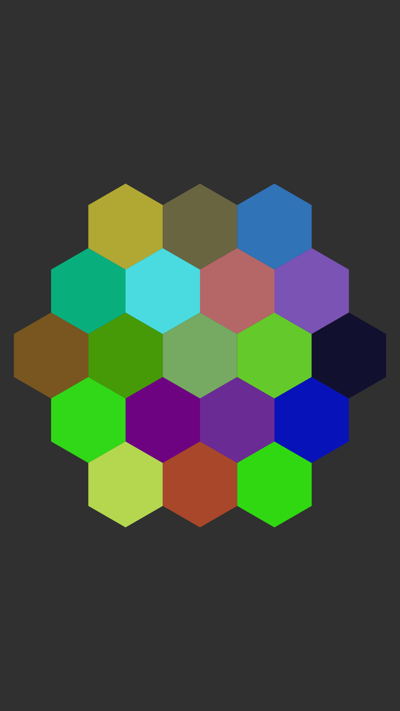

# ColorPickerView
Custom Android View for picking colors. Total colors count depends on radius set which is the amount of color shapes along the view's radius. Colors shown in shapes depend on the colors list passed to the view. By default, the colors are random. Touching the view makes it call the listener's method with touched color as a parameter.
### Usage
Declaring view in layout:
```xml
    <tw0reck1.colorpicker.ColorPickerView
        android:id="@+id/colorpickerview"
        android:layout_width="match_parent"
        android:layout_height="wrap_content"
        android:padding="12dp"
        app:cpv_radius="2"
        app:cpv_stroke_width="4dp"
        app:cpv_stroke_color="@android:color/black"/>
```
Setup code:
```java
...
    mColorPickerView = (ColorPickerView) findViewById(R.id.colorpickerview);
    mColorPickerView.setOnColorPickedListener(this);
    mColorPickerView.setColors(Arrays.asList(
            Color.DKGRAY, Color.WHITE, Color.WHITE, Color.GRAY, Color.DKGRAY, Color.DKGRAY, Color.WHITE
    ));
}

@Override
public void onColorPicked(int color) {
    mColorPickerView.setBackgroundColor(color);
}
```

### Samples

